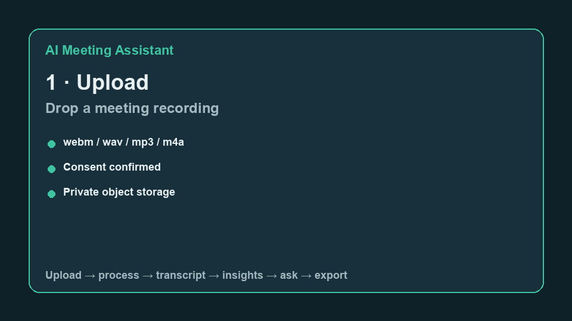
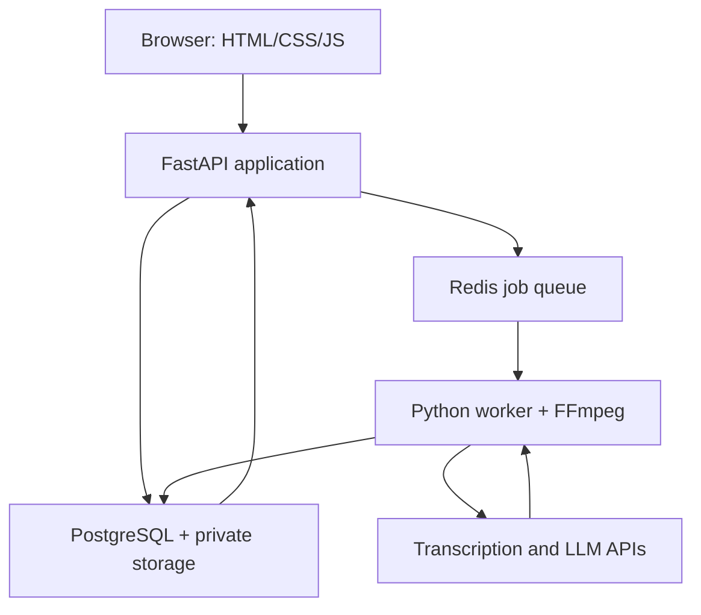
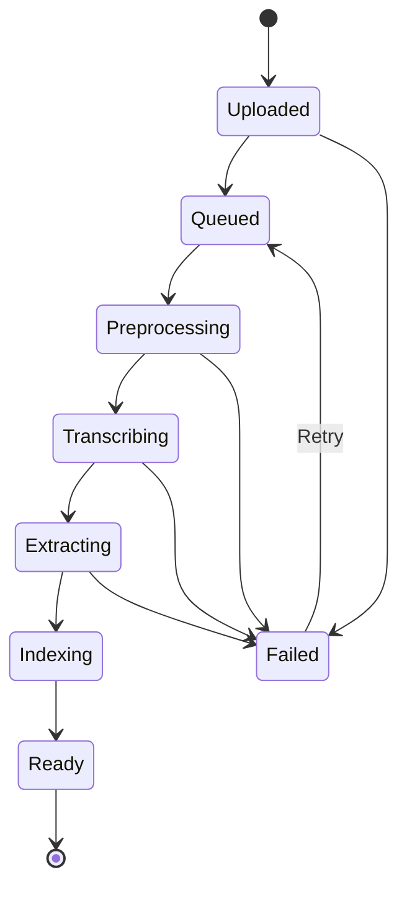

# AI Meeting Assistant

Turn meeting audio into a speaker-aware transcript, grounded summaries, action items, and cited Q&A.



[Live demo](http://localhost:8000/) · [Try locally](#try-locally)

- **Speaker-aware transcript** with timestamps you can search and jump to
- **Structured insights** — decisions, owners, due dates, and evidence links
- **Ask with citations** — answers grounded in the transcript, or an honest “not found”

---

## Why this project

Most meeting tools produce a block of transcript text. This project turns a recording into structured, useful meeting intelligence:

- Speaker-aware transcript with timestamps
- Concise and detailed summaries
- Decisions, action items, owners, due dates, questions, risks, and follow-ups
- Evidence links from every important extracted item back to the transcript
- Search and question answering over past meetings
- Export to Markdown, JSON, and PDF
- Consent, private storage, retention, and permanent deletion controls

## MVP capabilities

1. Create an account and sign in.
2. Start, pause, resume, and stop a microphone recording in the browser.
3. Upload an existing `webm`, `wav`, `mp3`, `m4a`, `mp4`, `mpeg`, or `mpga` file.
4. Add meeting metadata: title, date, participants, language, and meeting type.
5. Process the recording asynchronously and show live job status.
6. Display a speaker-labelled, timestamped transcript.
7. Generate structured meeting intelligence:
   - one-sentence summary
   - executive summary
   - key points
   - decisions
   - action items
   - open questions
   - risks and blockers
   - topics and tags
   - follow-up email draft
8. Edit speaker names, transcript text, actions, decisions, and summary content.
9. Search within a transcript and jump to the matching audio time.
10. Export the result and permanently delete the meeting and audio.

## Advanced capabilities

- Ask questions across one meeting or all meetings with timestamp citations
- Semantic search using embeddings and PostgreSQL/pgvector
- Calendar integrations and automatic meeting metadata
- Shareable read-only meeting pages with expiring links
- Team workspaces and role-based permissions
- Multilingual summaries and translation
- User-defined summary templates for interviews, stand-ups, sales calls, and research meetings
- Automatic email, Slack, Linear, Jira, or Notion follow-up actions
- Analytics for speaking time, meeting length, topics, and action completion
- Real-time partial transcription as a later phase

## Recommended technology stack

| Layer | Technology | Purpose |
| --- | --- | --- |
| Frontend | HTML5, CSS3, vanilla JavaScript | Responsive interface and browser recording |
| Browser audio | `MediaRecorder` and `getUserMedia` | Capture microphone audio in chunks |
| API | Python 3.12+, FastAPI, Pydantic | Typed REST API and validation |
| Database | PostgreSQL | Users, meetings, transcript segments, and insights |
| Auth and storage | Supabase Auth and private Storage | Authentication and private audio objects |
| Background work | Redis + RQ or Celery | Reliable transcription and summarization jobs |
| Audio processing | FFmpeg | Normalize, compress, inspect, and split audio |
| Transcription | OpenAI Audio Transcriptions API | Transcript, timestamps, and optional speakers |
| Meeting extraction | OpenAI Responses API + Structured Outputs | Schema-valid summary, decisions, and actions |
| Retrieval | pgvector, added after MVP | Semantic meeting Q&A with evidence |
| Testing | Pytest, HTTPX, Playwright | Unit, integration, API, and browser tests |
| Quality | Ruff, mypy, ESLint, Prettier | Consistent code and static checks |
| Packaging | Docker and Docker Compose | Reproducible local and cloud environments |
| Deployment | Render for API/worker; Supabase for DB/auth/storage | Simple portfolio deployment |
| CI/CD | GitHub Actions | Lint, test, security checks, and deployment gate |

The summarization model is configured through an environment variable rather than hard-coded. The application should use a current model that supports Structured Outputs.

## High-level architecture



## Processing flow



## Important product boundary

The MVP records microphone input or processes a file the user uploads. A normal browser page cannot universally capture every participant's Zoom, Teams, or Meet audio. Capturing tab/system audio requires screen-sharing permission and varies by browser and operating system. Direct meeting-platform bots and integrations belong in a later phase.

## Repository blueprint

```text
ai-meeting-assistant/
├── README.md
├── PROJECT_PLAN.md
├── DATA_AND_API_SPEC.md
├── LICENSE
├── .env.example
├── .gitignore
├── docker-compose.yml
├── render.yaml
├── frontend/
│   ├── index.html
│   ├── app.html
│   ├── meeting.html
│   ├── css/
│   │   ├── tokens.css
│   │   ├── base.css
│   │   └── components.css
│   ├── js/
│   │   ├── api.js
│   │   ├── auth.js
│   │   ├── landing.js
│   │   ├── recorder.js
│   │   ├── dashboard.js
│   │   ├── meeting.js
│   │   └── ui.js
│   └── assets/
├── backend/
│   ├── pyproject.toml
│   ├── Dockerfile
│   ├── alembic.ini
│   ├── migrations/
│   ├── app/
│   │   ├── main.py
│   │   ├── config.py
│   │   ├── database.py
│   │   ├── dependencies.py
│   │   ├── models/
│   │   ├── schemas/
│   │   ├── routes/
│   │   ├── services/
│   │   ├── prompts/
│   │   └── workers/
│   └── tests/
├── evals/
│   ├── fixtures/
│   ├── gold/
│   ├── rubrics/
│   └── run_evals.py
├── scripts/
│   ├── seed_demo.py
│   ├── make_demo_gif.py
│   └── create_sample_audio.py
└── docs/
    ├── architecture.md
    ├── privacy.md
    ├── threat-model.md
    └── screenshots/
```

## Try locally (free — no Docker / Redis / Postgres / OpenAI)

```bash
git clone <repository-url>
cd ai-meeting-assistant
cp .env.example .env   # already set for SQLite + mock AI
./scripts/run_local.sh
```

Open [http://localhost:8000](http://localhost:8000) → **View demo meeting**.  
Ops status: [http://localhost:8000/status](http://localhost:8000/status).  
Docs (dev only): [http://localhost:8000/docs](http://localhost:8000/docs).

Optional: seed/refresh the demo meeting:

```bash
cd backend && PYTHONPATH=. ../.venv/bin/python -m app.scripts.seed_demo
```

### Docker Compose (optional)

If you have Docker installed:

```bash
cp .env.example .env
docker compose up --build
```

Regenerate the README demo GIF (requires Pillow):

```bash
pip install pillow
python scripts/make_demo_gif.py
```

Run offline evaluations:

```bash
python evals/run_evals.py
```

## Documentation

- [Detailed implementation plan](PROJECT_PLAN.md)
- [Data, AI output, database, API, and evaluation specification](DATA_AND_API_SPEC.md)
- [Deployment](docs/deployment.md)
- [Evaluation and limitations](docs/evaluation.md)
- [Optional integrations](docs/integrations.md)
- [Contributing guide](CONTRIBUTING.md)
- [Security policy](SECURITY.md)
- [Code of conduct](CODE_OF_CONDUCT.md)
- [Architecture notes and ADRs](docs/architecture.md)

## Responsible recording

Users must obtain informed consent from every participant before recording. The interface must show an explicit confirmation before recording begins. Audio and transcripts are sensitive data and must be private by default, protected in transit and at rest, and removable through permanent deletion.

## Official implementation references

- [MediaRecorder browser API](https://developer.mozilla.org/en-US/docs/Web/API/MediaRecorder)
- [FastAPI file uploads](https://fastapi.tiangolo.com/tutorial/request-files/)
- [OpenAI file transcription](https://developers.openai.com/api/docs/guides/speech-to-text)
- [OpenAI Structured Outputs](https://developers.openai.com/api/docs/guides/structured-outputs)
- [Supabase Storage](https://supabase.com/docs/guides/storage)
- [Render background workers](https://render.com/docs/background-workers)

## License

MIT is recommended for the code. Do not add third-party meeting recordings, transcripts, or datasets to the repository unless their licenses and participant consent explicitly permit redistribution.
