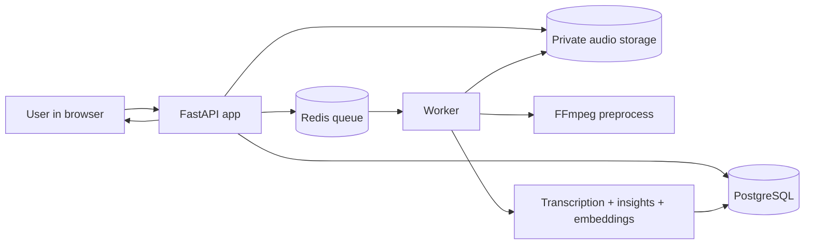
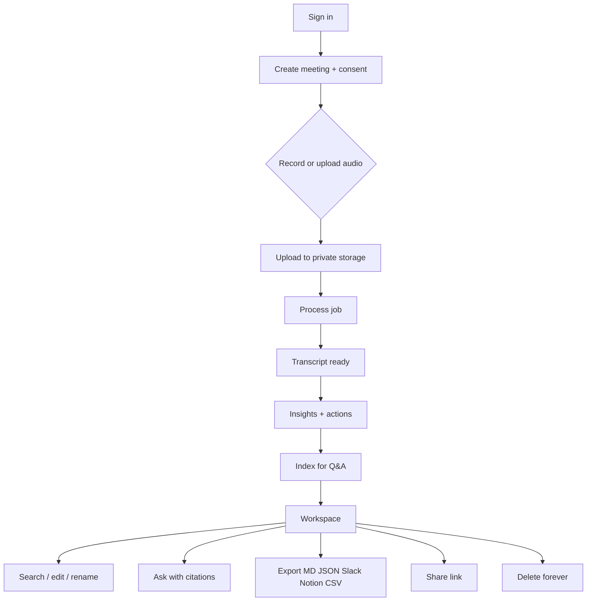
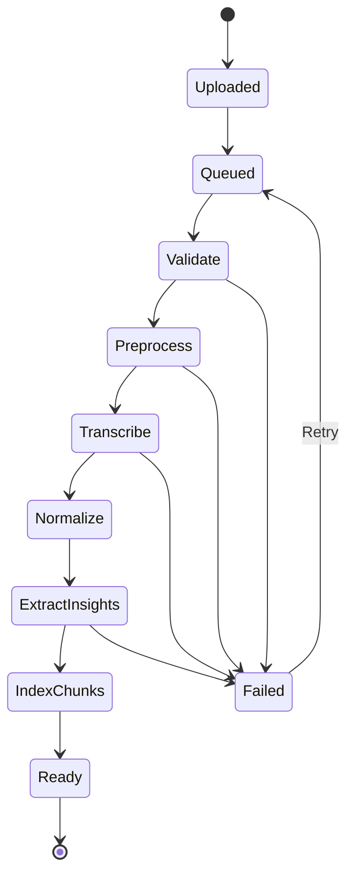
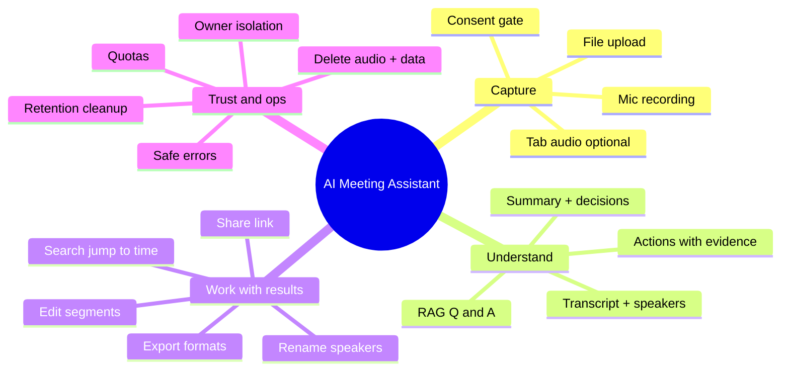
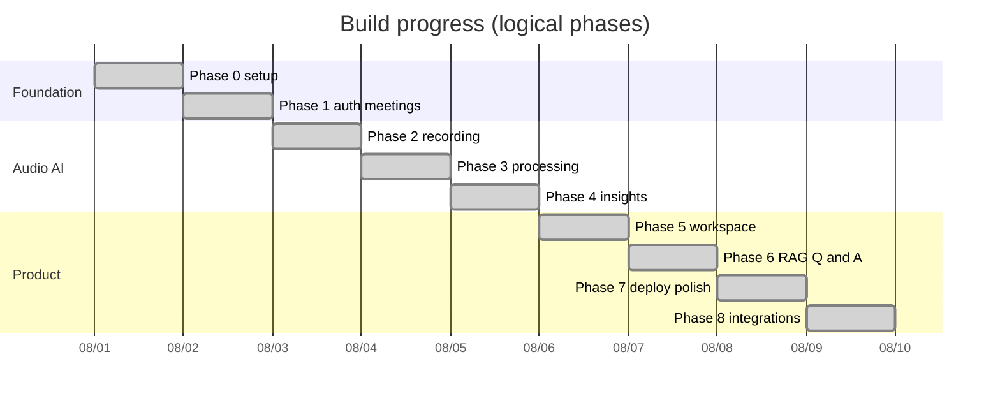

# Plan — AI Meeting Assistant

Summary of **what this project does**, **how it works**, and **what was built**.

---

## What the project does

AI Meeting Assistant turns meeting audio into useful, private meeting memory:

1. Record in the browser (mic or optional tab audio) or upload a file  
2. Confirm consent, then process asynchronously  
3. Produce a speaker-aware, timestamped transcript  
4. Extract summary, decisions, action items, and risks — each tied to transcript evidence  
5. Search, edit, rename speakers, export, share, and ask grounded questions  
6. Delete the meeting and its audio permanently  

**Audience:** portfolio / demo product showing end-to-end AI + data + privacy design.

---

## Big picture (chart)



---

## User journey (chart)



---

## Processing pipeline (chart)



---

## Product capabilities (chart)



---

## What was done (by phase)

| Phase | Focus | Status |
| --- | --- | --- |
| **0 / Setup** | FastAPI, health, landing, Docker Compose, CI, docs/ADRs | Done |
| **1** | Users, meetings, participants, JWT/dev auth, dashboard | Done |
| **2** | Consent, MediaRecorder, upload, local private storage, playback | Done |
| **3** | Jobs, preprocess, mock transcription, transcript API, process UI | Done |
| **4** | Insights/actions with evidence validation, editable overview | Done |
| **5** | Workspace: audio↔transcript sync, search, rename, export, delete | Done |
| **6** | Chunk index, embeddings, grounded Q&A + chat citations | Done |
| **7** | Quotas, retention, request IDs, seed demo, evals, Render, a11y | Done |
| **8** | Share links, ICS import, Slack/Notion/CSV, templates, tab audio | Done |



---

## Main pieces built

### Backend (`backend/app/`)
- Auth (dev login / JWT), meeting CRUD with owner isolation  
- Recordings: initiate → upload → complete → playback  
- Pipeline jobs (inline or RQ worker)  
- Insights + action items + evidence checks  
- Transcript edit/search/speaker rename  
- Chunk indexing + meeting Q&A with citation validation  
- Share links, ICS import, multi-format exports  
- Quotas, retention purge, request-ID / safe errors  

### Frontend (`frontend/`)
- Landing, login, dashboard  
- New meeting (record / upload / tab audio)  
- Meeting workspace (audio sync, overview, ask, export, share, delete)  
- Public share page  

### Ops & quality
- Docker Compose, `render.yaml`  
- Alembic migrations `0001`–`0006`  
- Pytest (~34 tests), Ruff, mypy, ESLint, Prettier, CI  
- `scripts/seed_demo.py`, `evals/run_evals.py`  
- Docs: architecture, deployment, evaluation, integrations  
- Screenshot: `docs/screenshots/screenshot.png`  

---

## Stack

| Layer | Choice |
| --- | --- |
| UI | HTML / CSS / vanilla JS |
| API | FastAPI + Pydantic |
| DB | PostgreSQL (SQLite in tests) |
| Queue | Redis + RQ |
| Audio | FFmpeg (or mock) |
| AI (CI/demo) | Mock transcription, insights, embeddings, Q&A |
| Deploy sketch | Render + Supabase (production path) |

---

## Still deferred (optional later)

- Full team workspaces / RBAC  
- Live OAuth push into Notion / Slack / Linear  
- Real-time streaming transcription  

## Phase A — Real OpenAI providers (done)

When `OPENAI_API_KEY` is set, factories return:

| Capability | Provider class | Default model env |
| --- | --- | --- |
| Transcription | `OpenAITranscriptionProvider` | `OPENAI_TRANSCRIPTION_MODEL` |
| Insights | `OpenAIMeetingIntelligenceProvider` | `OPENAI_SUMMARY_MODEL` |
| Embeddings | `OpenAIEmbeddingProvider` | `OPENAI_EMBEDDING_MODEL` |
| Q&A | `OpenAIQAProvider` | `OPENAI_QA_MODEL` |

Otherwise mocks stay active (CI). Startup logs `AI provider mode: openai|mock`.  
Sample audio: `evals/fixtures/mtg_001_60s.wav` (+ `.m4a`).

## Phase B — Guardrails (done)

- Monthly audio + LLM token caps; `GET /api/v1/me/usage`
- PII redaction on stored insights (`REDACT_PII`)
- Delete-forever verified (row, audio, embeddings, shares)

## Phase C — Demoable (done)

- Seeded “Try me” meeting + landing **View demo meeting** (read-only)
- `docs/screenshots/demo.gif` + polished README top-of-fold

## Phase D — Deploy sketch (done)

- `render.yaml`: web + worker + Redis + retention cron; Supabase Postgres
- Public `/status`; IP upload rate limit (20/day)

## Phase E — Frontend polish (done)

- Light/dark theme + toggle
- Workspace shortcuts (`j`/`k`, space, `/`, `?`)
- Loading / empty / error states with next actions

---

## How to run locally

```bash
cp .env.example .env
docker compose up --build
# App: http://localhost:8000

python scripts/seed_demo.py   # Try me — Aurora weekly sync (demo@example.com)
# Landing: View demo meeting → POST /api/v1/auth/demo-login (read-only)
python evals/run_evals.py     # offline quality checks
```

---

## Related docs

- Detailed roadmap: [`PROJECT_PLAN.md`](PROJECT_PLAN.md)  
- Data/API/AI contract: [`DATA_AND_API_SPEC.md`](DATA_AND_API_SPEC.md)  
- Architecture status: [`docs/architecture.md`](docs/architecture.md)  
- Screenshot: [`docs/screenshots/screenshot.png`](docs/screenshots/screenshot.png)  
